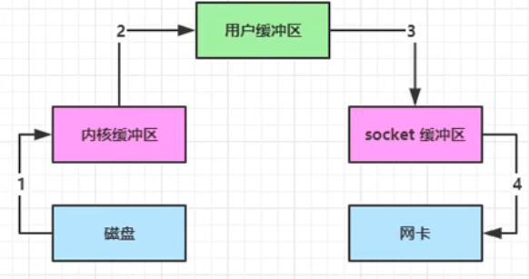
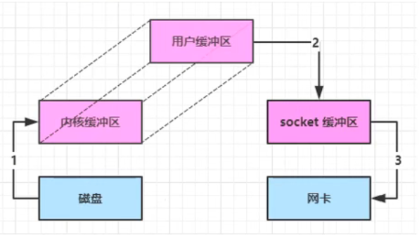
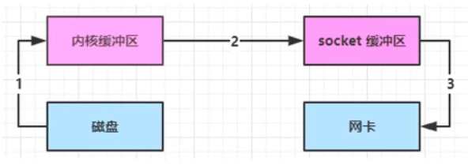
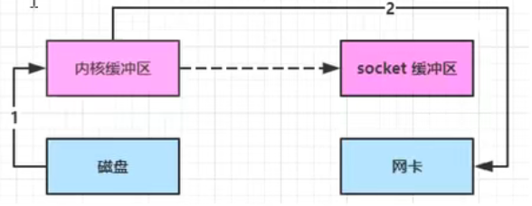
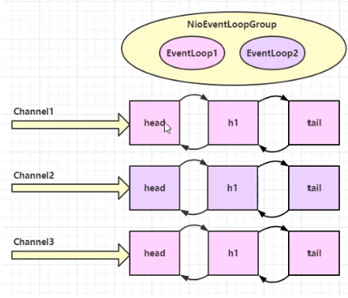
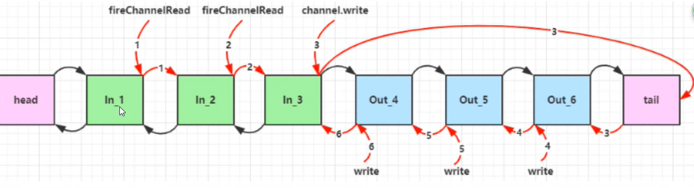
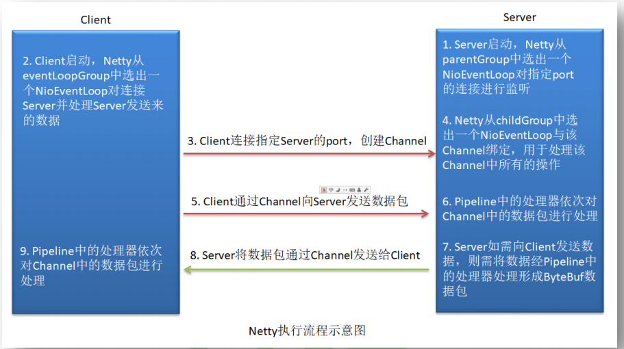
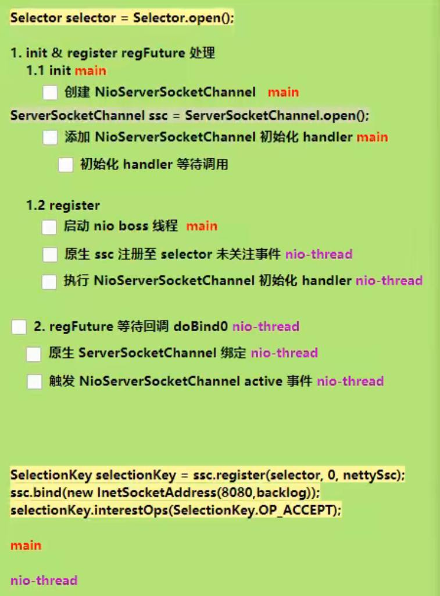

# NIO

传统IO流程：



NIO优化1：




NIO优化2：linux2.1



NIO优化3：linux 2.4




# Netty

## 组件
### Channel
管道,对Socket的封装，简化Socket操作
### EventLoop

每个Channel都对应着一个EventLoop，用来处理用户连接请求、对用户请求处理等所有事件。它的本质是一个单线程执行器(同时维护了一个Selector)

EventLoop 本身只是一个线程驱动，在其生命周期内只会绑定一个线程，让该线程处理一个 Channel 的所有 IO 事件。

一个EventLoop可以对应多个Channel，一个Channel只能对应一个EventLoop

EventLoopGroup 是一组EventGroup，Channel一般会调用EventLoop的register方法来绑定其中一个EventLoop，后续这个Channel上的io事件都由此EventLoop来处理（保证IO线程安全）



### ServerBootStrap
用于配置整个 Netty 代码，将各个组件关联起来。服务端使用的是 ServerBootStrap，而客户端使用的是则 BootStrap。
###  Handler & Pipeline
ChannelHandler 是对 Channel 中数据的处理器，这些处理器可以是系统本身定义好的编解码器，也可以是用户自定义的。这些处理器会被统一添加到一个 ChannelPipeline 的对象中，然后按照添加的顺序对 Channel 中的数据进行依次处理。

- 入站处理器：ChannelInboundHandlerAdapter,读取客户端数据，写回结果
- 出站处理器：ChannelOutboundHandlerAdapter,对写回的结果加工
- SimpleChannelInboundHandler中的channelRead()方法会自动释放接收到的来自于对方的msg所占有的所有资源。
- ChannelInboundHandlerAdapter 中的 channelRead()方法不会自动释放接收到的来自于对方的msg

pipeline中默认有 head和tail两个handler，每次添加的handler都是在tail之前。

**pipeline中handler的执行顺序**：

入站是根据添加handler的顺序执行，出站是根据添加handler的顺序的方向执行。

 :heavy_exclamation_mark: ​入站:

```java
//传递数据到下一个handler
ctx.fireChannelRead(msg);
```

:rotating_light: 出站：

有多个出站处理器的时候，要在最后一个调用`ctx.writeAndFlush`，当调用这个方法的时候，会从当前handler往前找出站处理器.`ctx.channel().writeAndFlush` 会从tail开始找出站处理器进行处理。




### Future & Promise
对异步操作进行回调，通过该对象的`addListener()`注册回调。

和异步方法配套使用，用来处理结果（建立连接、关闭连接 etc.）。处理结果的方法：

- 使用ChannelFuture.sync()同步处理结果 main 线程
- 使用ChannelFuture.addListener() 异步处理结果  nio 线程

```java
// 同步处理结果,主线程阻塞
channelFuture.sync();

//---------
// 异步处理
channelFuture.addListener(new ChannelFutureListener(){
    @Override
    // nio线程建立好连接之后，会调用该方法
    public void operationComplete(ChannelFuture future) throws Exception{
        future.channel();
        ....
    }
})
```

**异步提升了吞吐量（单位时间内处理请求的速度）**

**Netty的异步编程模型都是建立在 Future的概念之上的**

### ByteBuf

#### 直接内存 vs 堆内存

**直接内存**：分配效率低，读写效率高（少一次内存拷贝）系统内存映射到JAVA内存。配合池化一起 使用

**堆内存**：分配效率高，读写效率低

#### 池化 vs 非池化

池化最大意义就是可以复用 ByteBuf

- 高并发时，池化更解决内存，减少内存溢出的可能

通过环境变量设置池化是否开启：

`-Dio.netty.allocator.type={unpooled|pooled}`

- \>=4.1 ,非Android平台默认开启池化，Android启动非池化。
- < 4.1 ,默认非池化

#### 组成


#### 扩容

针对版本

- 写入后数据大小超过 4M(1024\*1024\*4)  ，则选择4M的整数倍，

```java
 if (minNewCapacity > threshold) {
     int newCapacity = minNewCapacity / threshold * threshold; // 向下取整到4M的整数倍
     if (newCapacity > maxCapacity - threshold) { // 加上4M后大于了最大容量 则直接取最大容量 否则取加上4M之后的数
         newCapacity = maxCapacity;
     } else {
         newCapacity += threshold;
     }
     return newCapacity;
 }
```

- 写入后数据大小未超过4M，则选择2^n,满足2^n>=64&&>=newCapacity，比如写入后的大小是65 则选择 2^7(因为2^6=64),如果写入后是63 ，则选择64

```java
  // 64 <= newCapacity is a power of 2 <= threshold
final int newCapacity = MathUtil.findNextPositivePowerOfTwo(Math.max(minNewCapacity, 64)); // 
return Math.min(newCapacity, maxCapacity);

//返回2^n ,满足 2^n >= value 
public static int findNextPositivePowerOfTwo(final int value) {
    assert value > Integer.MIN_VALUE && value < 0x40000000;
    return 1 << (32 - Integer.numberOfLeadingZeros(value - 1));
}
```


创建byteBuf的时机：

AbstractNioByteChannel.java

```java
public final void read() {
            final ChannelConfig config = config();
            if (shouldBreakReadReady(config)) {
                clearReadPending();
                return;
            }
            final ChannelPipeline pipeline = pipeline();
            final ByteBufAllocator allocator = config.getAllocator();
            final RecvByteBufAllocator.Handle allocHandle = recvBufAllocHandle();
            allocHandle.reset(config);

            ByteBuf byteBuf = null;
            boolean close = false;
            try {
                do {
                    byteBuf = allocHandle.allocate(allocator);
                    allocHandle.lastBytesRead(doReadBytes(byteBuf));
                    if (allocHandle.lastBytesRead() <= 0) {
                        // nothing was read. release the buffer.
                        byteBuf.release();
                        byteBuf = null;
                        close = allocHandle.lastBytesRead() < 0;
                        if (close) {
                            // There is nothing left to read as we received an EOF.
                            readPending = false;
                        }
                        break;
                    }

                    allocHandle.incMessagesRead(1);
                    readPending = false;
                    pipeline.fireChannelRead(byteBuf);
                    byteBuf = null;
                } while (allocHandle.continueReading());

                allocHandle.readComplete();
                pipeline.fireChannelReadComplete();

                if (close) {
                    closeOnRead(pipeline);
                }
            } catch (Throwable t) {
                handleReadException(pipeline, byteBuf, t, close, allocHandle);
            } finally {
                // Check if there is a readPending which was not processed yet.
                // This could be for two reasons:
                // * The user called Channel.read() or ChannelHandlerContext.read() in channelRead(...) method
                // * The user called Channel.read() or ChannelHandlerContext.read() in channelReadComplete(...) method
                //
                // See https://github.com/netty/netty/issues/2254
                if (!readPending && !config.isAutoRead()) {
                    removeReadOp();
                }
            }
        }
    }
```

#### 内存回收

- UnpooledHeapByteBuf使用JVM内存，等到gc回收
- UnpooledDirectByteBuf 使用直接内存，调用方法来回收
- PooledBytebuf和其子类，更复杂的方法回收

#### 零拷贝

- slice

在切片的过程中，不会发生数据复制

- duplicate
- copy
- composite


## Netty执行流程



## 粘包与拆包

通过网络发送的一批二进制数据包，称为frame

- 当发送方的二进制数据包太大（太多），则会进行**拆包**被拆分成多个frame。接收方会进行**粘包**
- 当发送方的二进制数据包太小无法构成一个frame，则会将多个很小的数据包进行**粘包**合并成一个frame。接收方会进行**拆包**

### TCP滑动窗口

TCP传输过程中的缓存区域，发送端和接收端都有会有一个滑动窗口。

发送窗口和接收窗口的本质是在操作系统中开辟的一块循环利用的缓冲区，用于存储要发送和接收数据。本质是一个循环数组的实现。利用若干指针来维护相关的区域。当数据写入超过缓冲区的最大地址后，就循环利用头部，覆盖头部的数据。

在一个滑动窗口内，发送端不需要等到接收端的应答就可以发起下一次通信；当接收到应答之后，滑动窗口就会向前滑动。

### 问题分析

粘包

- 现象，发送abc def，接收abcdef
- 原因
  - 应用层：接收方 ByteBuf设置太大(Netty默认 1024)
  - 滑动窗口：假设发送方256bytes 表示一个完整的报文，但接收方处理不及时且窗口大小足够大（能够继续接收），这256bytes 字节就会缓冲在接收方的滑动窗口中，当滑动窗口中缓冲了多个报文就会粘包
  - **Nagle算法**：会造成粘包

半包

- 现象，发送 abcdef 接收 abc de f
- 原因
  - 应用层：接收方ByteBuf 小于实际发送数据量
  - 滑动窗口：假设接收方窗口只剩128bytes ，发送方的报文大小是256bytes，这时放不下了，只能先发送前128bytes，等待ack后才能发送剩余部分，这就造成了半包
  - MSS限制：当发送的数据超过 MSS限制后，会将数据切分发送，就会造成半包

**本质是因为TCP是流式协议，消息无边界**

### 解决办法

**本质：确定消息的边界**

1. 使用短连接：

   - 发送方每发一次就重新建立连接
   - 只能解决粘包问题，无法解决半包问题（当接收方的bytebuf小于发送方发送的数据大小，还是会发生半包情况）
   - 消息的边界：每次建立连接与断开连接

2. 定长解码器：

   `FixedLengthFrameDecoder`

   - 发送和接收双方需要约定一个长度来作为消息的边界


## 自定义协议

自定义协议一些要素

- 魔术，用来在第一时间判定是否是无效数据包
- 版本号，可以支持协议的升级
- 序列化算法，消息正文到底采用哪种序列化反序列化方式，可以由此扩展，例如:json、protobuf、hessian、jdk
- 指令类型，是登录、注册、单聊、群聊.....跟业务有关
- 请求序号，为了双工通信，提供异步能力
- 正文长度
- 消息正文

## 源码剖析

### 启动剖析

Netty如何处理下面的代码？

```java
//1 netty 中使用 NioEventLoopGroup （简称 nio boss 线程）来封装线程和 selector
Selector selector = Selector.open(); 

//2 创建 NioServerSocketChannel，同时会初始化它关联的 handler，以及为原生 ssc 存储 config
NioServerSocketChannel attachment = new NioServerSocketChannel();

//3 创建 NioServerSocketChannel 时，创建了 java 原生的 ServerSocketChannel
ServerSocketChannel serverSocketChannel = ServerSocketChannel.open(); 
serverSocketChannel.configureBlocking(false);

//4 启动 nio boss 线程执行接下来的操作

//5 注册（仅关联 selector 和 NioServerSocketChannel），未关注事件
SelectionKey selectionKey = serverSocketChannel.register(selector, 0, attachment);

//6 head -> 初始化器 -> ServerBootstrapAcceptor -> tail，初始化器是一次性的，只为添加 acceptor

//7 绑定端口
serverSocketChannel.bind(new InetSocketAddress(8080));

//8 触发 channel active 事件，在 head 中关注 op_accept 事件
selectionKey.interestOps(SelectionKey.OP_ACCEPT);
```

源码围绕下面的步骤来看：




