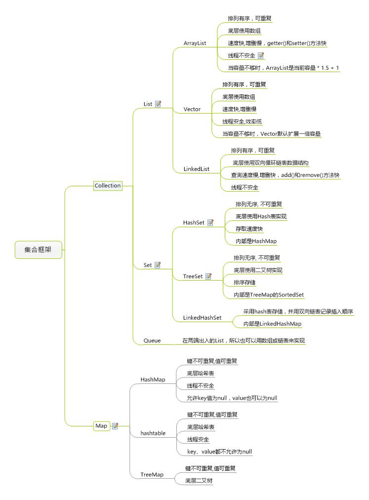

# 集合

## 1.重写equals为什么要重写hashCode?
1. 如果两个不同的对象，通过equals判断是相等的，但是hashCode不同。将出现我们在 HashMap 中，相等的对象作为 key ，将找不到对应的 value 

# 异常
## 1.常用的RuntimeException?

    NullPointerException
    IndexOutOfBoundsException
    ClassCastException
    ArrayStoreException
    BufferOverflowException
## 2.异常被处理后异常对象会发生什么?
异常对象会在下次 GC 执行时被回收。

# 反射

## 1. 反射中，Class.forName 和 ClassLoader 区别？
